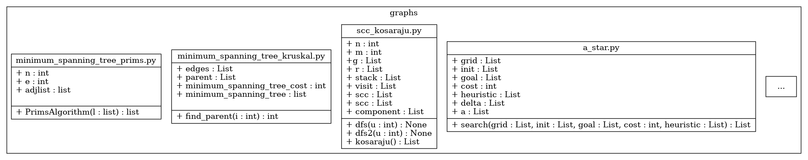
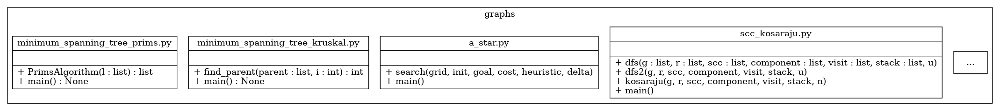

# Report for assignment 4

## Project

Name: TheAlgorithms/Python

URL: [TheAlgorithms/Python](https://github.com/TheAlgorithms/Python)

A collection of common algorithms implemented in Python for educational purposes.

## Selected issue(s)

Title: Adopt a more robust testing system \#309

URL: [#309](https://github.com/TheAlgorithms/Python/issues/309)

The current tests are incoherent and very limited in capability. There are few tests with each algorithm. Refactor into a more robust testing system.

## Onboarding experience

Onboarding is a bit of a mixed bag, probably much due to the lack of a
coherent test suite that can test the whole project. The project is internally
structured more like a collection of projects, than a single library. As
explained in [Test logs](#test-logs), certain parts support Python 2, others
Python 3, and some parts are seemingly just not working as intended. When it
comes to Python 3, most modules run just fine as long as you have a somewhat
recent version of Python 3 (~3.5+). This is the apex of onboarding: there is
none whatsoever, it just works out of the box. However, many of the more
advanced parts of the library, such as the `machine_learning` modules, rely on
external dependencies that are often not listed anywhere. You notice simply by
the fact that importing the module fails as some dependencies cannot be
resolved. Preferably, dependencies should be listed of a `setup.py` file such
that the project can be installed as a package, with dependencies.  We also
found that certain parts rely on
[`Tcl/Tk`](https://www.tcl.tk/software/tcltk/), which must be installed
separately. This is also not specified anywhere. Despite the somewhat convoluted
onboarding experience, we chose to proceed with refactoring this project mostly
because we thought we could do some real good here.

## Requirements affected by functionality being refactored

## Existing test cases relating to refactored code
* [`sorts`](sorts_analysis.md)
* [maths](./maths.md)
* [dynamic_programming](./dynamic_programming.md)
* [matrix](./matrix.md)
* [networking_flow](./networking_flow.md)
* [arithmetic_analysis](./arithmetic_analysis.md)
* [binary_tree](./binary_tree.md)
* [graphs](./graphs.md)
* [hashes](./hashes.md)
* [other](./other.md)
* [data_structures_analysis](./data_structure_analysis.md)
* [strings_analysis](./strings_analysis.md)

* [analysis](./analysis.md)
* [ciphers](./ciphers.md)
* [searches](./searches.md)

## The refactoring carried out

### Making the modules importable
The scope of the refactoring blew completely out of proportion. To even be able
to start refactoring the tests, we realized that we needed to make the modules
importable from the root of the project in at least one version of Python. This
essentially consisted of three things:

1. Move top level code (that execute on import) into main functions.
    - This was important much because a lot of the top level code used blocking
    I/O, which caused any unit test to just lock up.
2. Let any functions that used that glodal state take the values as parameters instead.
3. Creating a `setup.py` which allowed for the whole thing to be installed.

As there was no automated testing at all (becaues many of the modules simply
could not be imported), we had to figure out a way to get some kind of
consistent indication that what we were doing had an effect. We came up with the
idea of _import testing_. This consisted of iterating over all of the
directories, finding each Python module, generating it's fully qualified name
and then trying to dynamically import it.
[The import test can be found here](https://github.com/slarse/Python/blob/refactor_packaged/tests/test_imports.py).
Just making the modules importable seemed like a harmless enough task to carry
out withou proper test coverage, but it turned out to be a bit more complicated
than we thought in some cases. The UML-like image below shows what a part of the
`graphs` package looked like befor making it importable. Note that, as we did
not have many classes to deal with, we have modeled each Python module as a UML
class, where fields represent global state (top level code), and methods
represent top-level functions.

Note how all of the modules have global state. To make the modules testable, the
global state needs to be removed, or else one test will affect the next. The
below, again UML-like, image shows the same part of the `graphs` package, with
the whole spectrum of typical changes that we had to make to modules.

`minimum_spanning_tree_prims.py` shows the ideal scenario, and the one we were
naively expecting to hold true most of the time. The only thing that has had to
happen is that global state has been moved into a `main` function, while the
primary function of the module has been unchanged.
`minimum_spanning_tree_kruskal.py` and `a_star.py` show the most common
scenario: much global state has been moved into a `main` function, and the
primary function of the module has had a single parameter added to it. Both of
these examples are fairly low-risk, as the most likely error was to forget to add
a previously global variable to the parameter list. As `flake8` running on
Travis would flag any undefined variable
([for example this one](https://travis-ci.com/slarse/Python/jobs/179441422)),
we felt fairly confident this would not be a problem. The `scc_kosaraju.py`
file shows a worst-case example of what we had to do to get rid of global state.
The functions in the module have access to a _lot_ of global state that needs to
be added to the parameter lists. These were far and few between, but did crop up
from time to time. What made this particular module even worse was that not all
of the explicitly declared global state in each function was even used. However,
rectifying that felt out of scope for just making the module importable.

In summary, we managed to make all of the modules importable in Python 3, but
can not be certain we did not break any functionality along the way because of
the non-existent test coverage for many parts. We opened an
[issue about it here](https://github.com/TheAlgorithms/Python/issues/708),
and subsequently [a PR here](https://github.com/TheAlgorithms/Python/pull/714).

### Actually getting to the point: moving tests
Tests were spread about the initial project in various forms. There is no good
way to show this with a diagram (although we tried, see below), but we will
attempt to describe the process. There were essentially three types of tests
strewn about the project:

1. Actual unit tests.
    - These were far and few between, and translation to `pytest` was trivial.
2. Doctests.
    - These were quite numerous in some packages, especially in the
    [`sorts` package](https://github.com/slarse/Python/tree/master/sorts)
3. Just running code and printing the results.
    - These can be considered tests of sorts, but they are not automated in the
      least.

Please see the
[Existing test cases](#existing-test-cases-relating-to-refactored-code) section for more
details on the moved tests.

### Before and after: the big picture
As we touched so many modules, it was infeasible to manually create diagrams of
everything. What we turned to was to write a script that creates overarching
diagrams of the whole architecture by parsing the directory structure into a
tree, and recursively putting together a graphviz graph of the packages and
modules. Each module was also inspected for global variables and top-level
functions using the abstract syntax tree. You can view the
[before refactor here](diagrams/before_all.pdf), and the
[after refactor here](diagrams/after_all.pdf). Note that the PDFs are enormous,
and you will need to download and view them with some competent software to make
sense of it. The biggest differences between the before and after is that most
global state has been removed, and that the after has our test suite in it. The
test suite mirrors the packages, so tests for the `sorts` package are in
`tests/sorts`, etc.

## Test logs

Before we started our refactoring, the repository did contain a few proper unit
tests, but many were simply print statements. Before we started modifying the
code, we set up a `pytest` test suite and added a test to see how many modules
could be imported without errors in Python 2 and Python 3. The results were as
follows:

* [Python 2](before/py2_cov)
  - 150 tests passed
  - 106 tests failed
    - 14 IOErrors
    - 4 timeouts
    - 81 ImportErrors
  - 20 % code coverage
* [Python 3](before/py3_cov)
  - 171 tests passed
  - 85 tests failed
    - 32 OSErrors
    - 11 timeouts
    - 33 ModuleNotFoundErrors
  - 22 % code coverage

After our refactoring, all modules can be imported in Python 3. We decided to
drop support for Python 2 due to lack of time. In the test logs produced after
our refactoring, we also decided to not add a `thealgorithms` top-level
directory. The test logs can be found [here](after/py3_cov). The code coverage
including our new tests is 46 %.

## Effort spent

For each team member, how much time was spent in

1. plenary discussions/meetings;
2. discussions within parts of the group;
3. reading documentation;
4. configuration;
5. analyzing code/output;
6. writing documentation;
7. writing code;
8. running code?

### Lars
1. 12 hours
2. 0.5 hours
3. None
4. 3 hours
5. 1 hour
6. 4 hours
7. 6 hours
8. 0.5 hours

### Rouwayd
1. 10 hours
2. None
3. None
4. 2 hours
5. 2 hour
6. 5 hours
7. 7 hours
8. None

### Martin
1. 9.5 hours
2. 3 hours
3. None
4. 1 hours
5. 7.5 hours
6. 3 hours
7. 6.5 hours
8. 1 hours

### Kartik
1. 10 hours
2. 1 hour
3. 0.5 hours
4. 2.5 hours
5.  4 hours
6. 3 hours
7. 7 hours
8. 1 hour

### Simon
1. 12 hours
2. Didn't keep track of subway Slack messaging
3. 2 hours
4. 4 hours
5. 4 hours
6. 10 hours
7. 2 hours
8. Who just sits and waits for code to run?

## Overall experience

In the assignment description, the goal of this assignment is to teach us "the complexity of refactoring in a real project." This sentence sums up the main takeaway lesson well, and, in that sense, this assignment was a success. In particular, what we planned to do turned out to involve a whole lot more unexpected work. And in the end, it was the unexpected work that took the most time.

As with the last assignment, the corollary takeaway is that even popular repos can be slipshod and difficult to maintain. Our chosen repo this time is a very extreme example, however. This repo is extremely difficult to maintain. The repo is not a package, but rather a broad collection of algorithms and solutions for education or demonstration purposes. It is expected, then, for the contents to be at least inconsistent. The problem, however, is that the solutions are mostly untested, or at least tested in an idiosyncratic manner. Consequently, in constructing a centralized testing suite for the repo, we ended up on some level standardizing the entire project.

Note that although one of the most starred python repos on Github, and although comprising about 250 modules, our chosen repo has only about a couple maintainers. As our work revealed, several to most of the modules don't run in any useful way or are downright broken. Unfortunately, we do not have time to fix them all. So, another main takeaway is just how important robust and automated testing really is for the long term.

Another takeaway that somewhat mirrors the last assignment is some frustration with the assignment. While more clear and centralized in its tasks compared to the previous assignment, this assignment nevertheless has some problems.

It seems to us that either the time frame needs to be extended or the project selection requirements need to be relaxed. Probably both. It is incredibly difficult to find a project that satisfies the requirements, that has an already open refactor issue that is not being worked on, and, on top of all that, that can be gotten into quickly. It was said that it is OK to choose a smaller project, but 10k lines seems far from small, especially for the more concise languages. We consider ourselves very lucky in finding a relatively manageable project. For at least the past week, however, many of us have had to treat this course as if it were a full time job.
